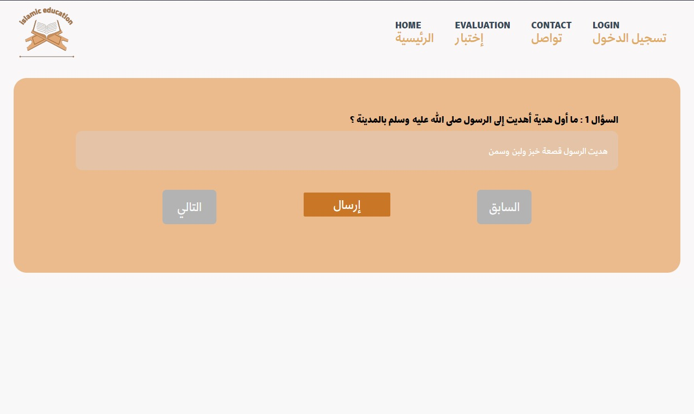
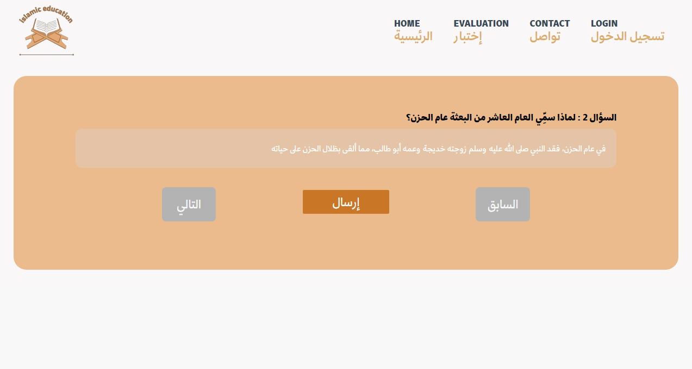
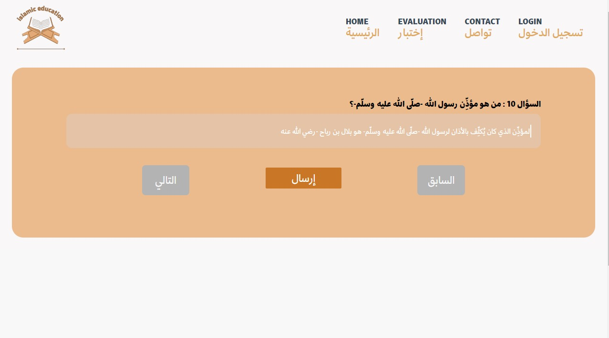
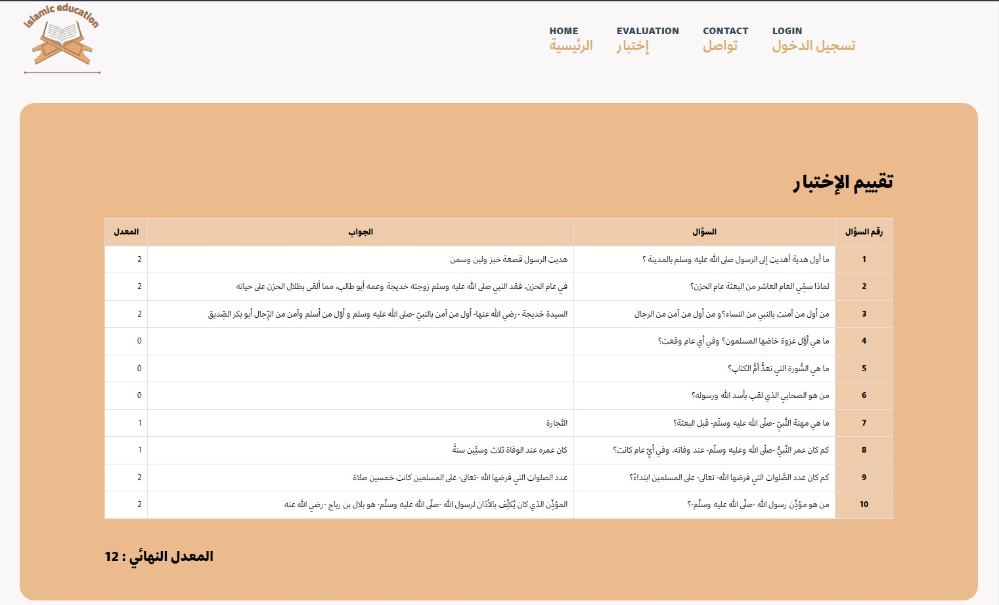

# Arabic Automated Short Answers Grading System

The project aims to develop an Arabic Automated Short Answers Grading System and Smart Assistance for Islamic education for schoolers. The system's primary goal is to assign grades (ranging from 0 to 20) to students based on the accuracy of their answers. It will be entirely in Arabic, and the dataset will be prepared by collecting raw data from various resources using scraping techniques.

- Scraping data from several sources: Arabic websites, Datasets, books, etc.
- Establishment of Arabic Natural language processing pipeline.
- Word embedding and encoding.
- Model Training based on RNN, LSTM and Transformer.
- Evaluation of the models then the choice of the best one.
- Model deployment and consumption via spa web application.

**Tools :** FastAPI, Angular, Docker, Github, Scrapy, NLTK, Word2Vec.

## Table of contents

[Scraping Data](#scraping-data)

[Establishment of Arabic Natural language processing pipeline](#establishment-of-arabic-natural-language-processing-pipeline)

[Testing the Application](#testing-the-application)
* [Home Page](#home-page)
* [Question Page](#question-page)
* [Result Page](#result-page)
[Contributors](#contributors)

## Scraping data

The initial step in our project involves collecting raw data from diverse sources, including Arabic websites, datasets, and educational books. This varied dataset is essential for training and evaluating our Arabic Automated Short Answers Grading System and Smart Assistance for Islamic education.

# Establishment of Arabic Natural Language Processing Pipeline

In our project, the establishment of an Arabic Natural Language Processing (NLP) pipeline is a critical component. A pipeline, in the realm of machine learning, comprises a series of interconnected steps designed to address specific challenges in the Arabic language domain. This structured sequence of operations facilitates data processing, model training, and predictions on new data.

## Testing the Application

### Home Page

### Question Page

### Responding to questions

### Result Page
By clicking on the button ****ارسال**** the grades given by the models we trained will showed with the correct answers :

The page "تقييم الإختبار" shows the grades given by the models we trained along with the correct answers.

## Contributors

Alami Youssra

El younessi Oumaima

El Hammami Chaimae
